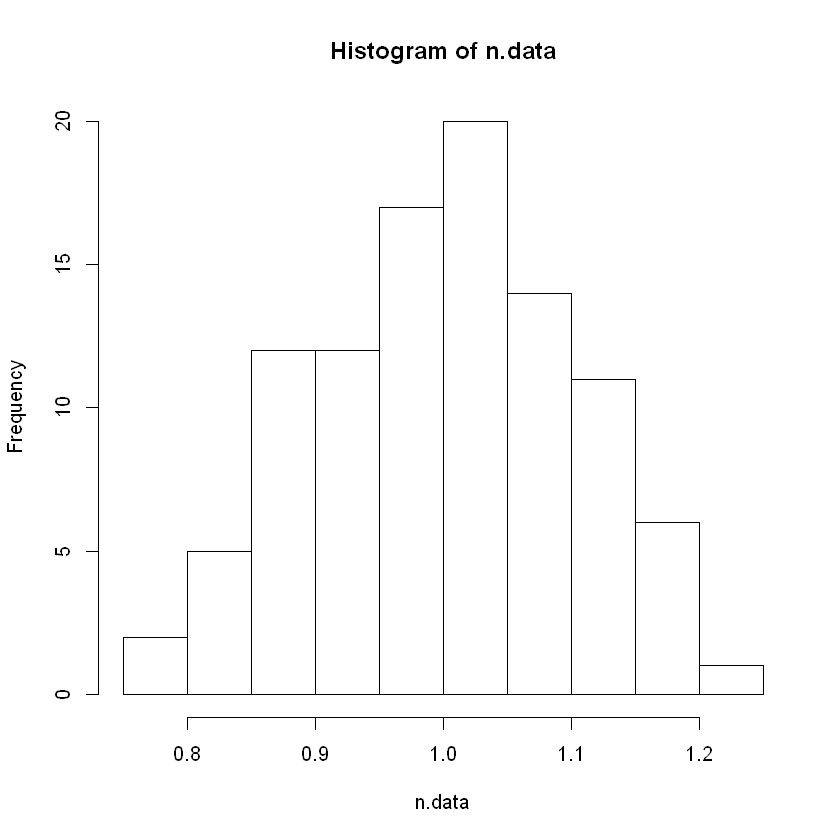
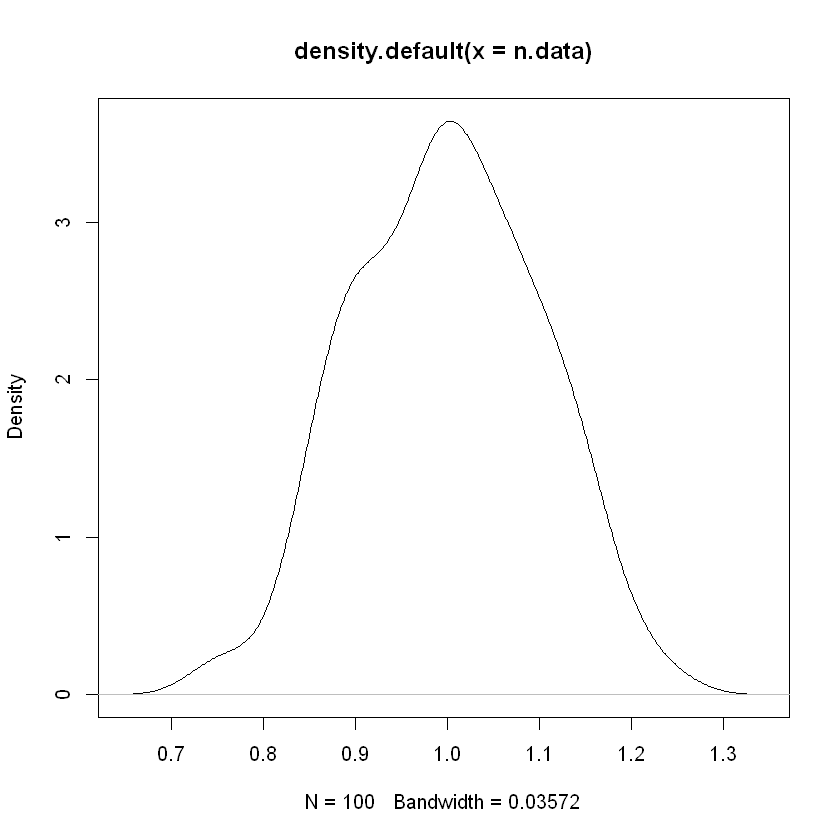

```R
?Distributions
```


```R
# To genetate 100 instances of normally distributed data with a mean equal to 1 and standard deviation equal to 0.1, use the following command.
n.data <- rnorm(n=100, mean=1, sd=0.1)
```


```R
#plot the histogram to observe the distribution 
hist(n.data)
```





```R
#Check the density of the distribution and observe the shape 
plot(density(n.data))
```





```R
# To identify the corresponding parameters for other prefixes
?pnorm
```
