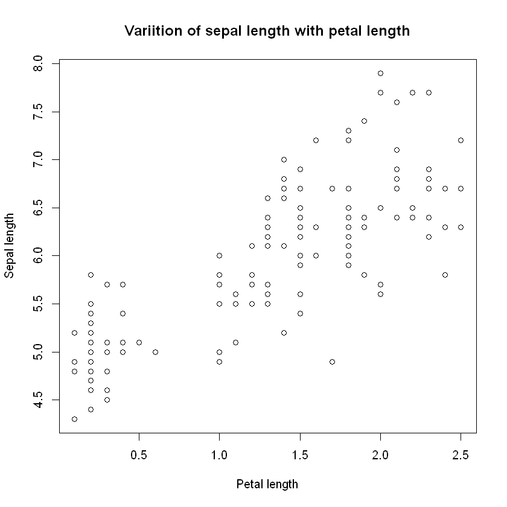
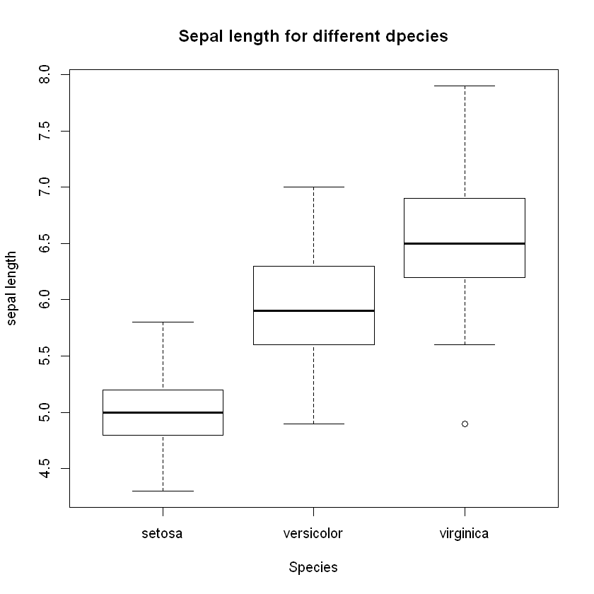
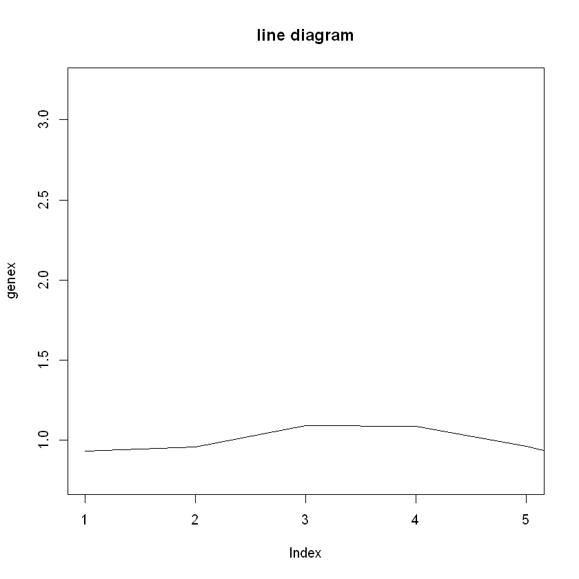
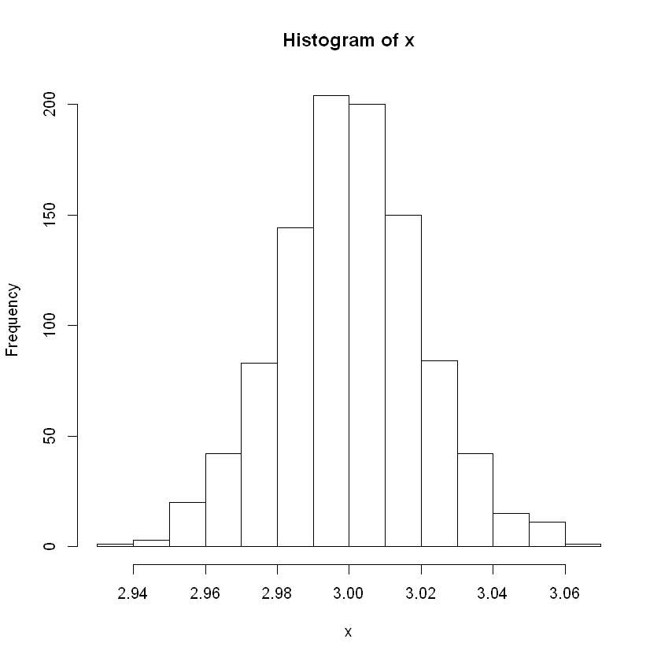

```R
# To create a scatter plot, start with your iris dataset. What you want to see is the variation of the sepal length and petal length.
data(iris)
s1 <- iris[,1]
p1 <- iris[,4]
plot(x=p1,y=s1,xlab="Petal length",ylab="Sepal length",col="black",main="Variition of sepal length with petal length")

```





```R
# To create a boxplot for the data 
boxplot(Sepal.Length~Species, data=iris, ylab="sepal length", xlab="Species",main="Sepal length for different dpecies")
```





```R
genex <- c(rnorm(100, 1 ,0.1), rnorm(100, 2, 0.1), rnorm(50, 3, 0.1))
plot(x=genex,xlim=c(1,5),type='l',main="line diagram")
```





```R
# Histograms can used to visualize the density of the data and the frequency of every bin/category.
x<- rnorm(1000,3,0.02)
hist(x)
```





```R
?rnorm
```
