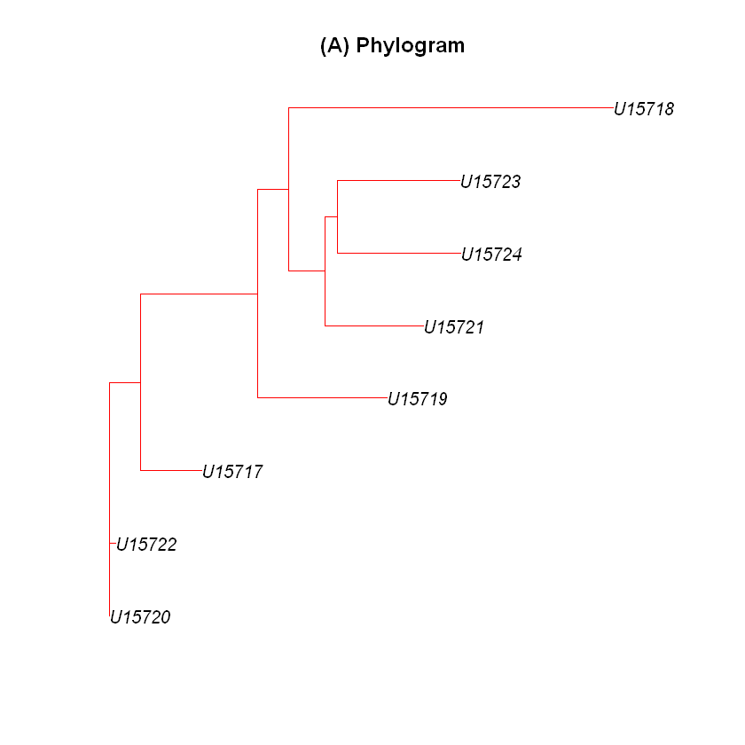
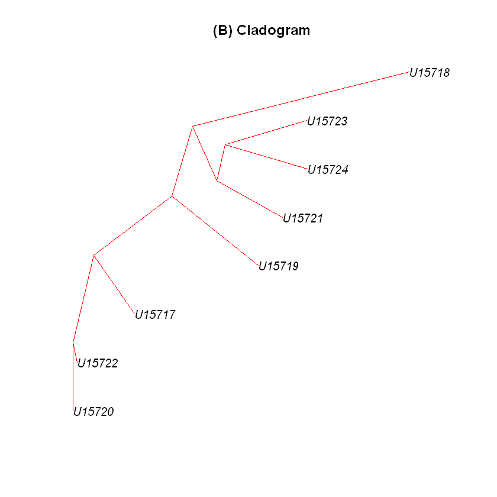
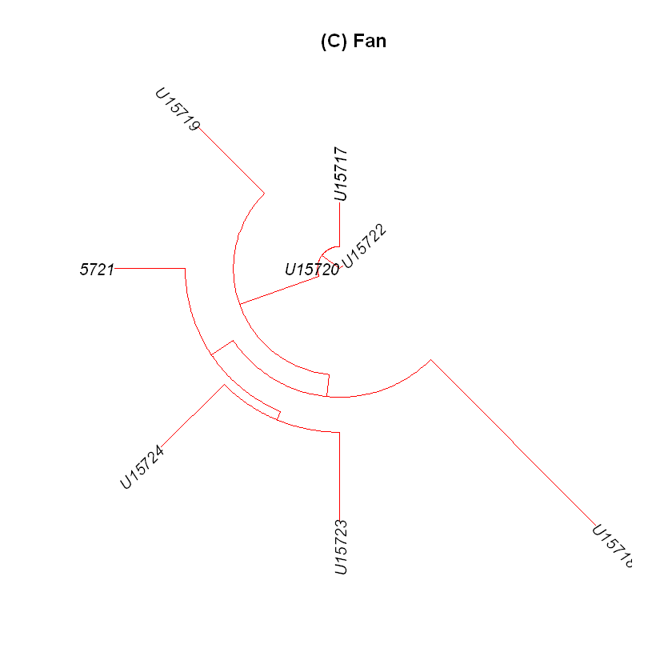
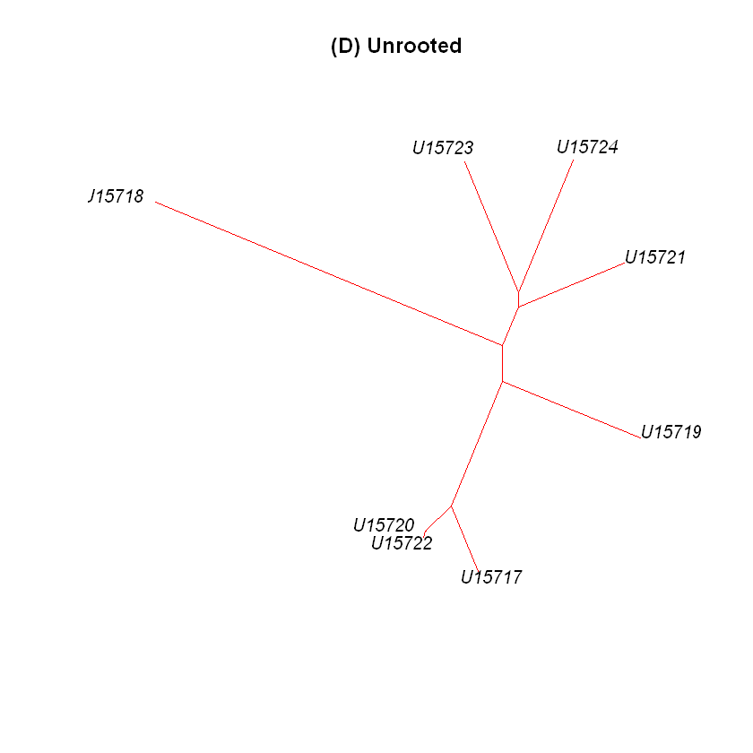

1. Install and load the ape package by typing the following command:


```R
install.packages("ape")
library(ape)
```

    Warning message:
    "unable to access index for repository http://www.stats.ox.ac.uk/pub/RWin/bin/windows/contrib/3.5:
      无法打开URL'http://www.stats.ox.ac.uk/pub/RWin/bin/windows/contrib/3.5/PACKAGES'"

    package 'ape' successfully unpacked and MD5 sums checked
    
    The downloaded binary packages are in
    	C:\Users\Administrator\AppData\Local\Temp\RtmpS2tF8E\downloaded_packages
    

2. Define the sequences of your interest as a set in terms of IDs as follows:


```R
myset <- c("U15717", "U15718", "U15719", "U15720", "U15721","U15722", "U15723", "U15724")
```

3. Fetch the sequences of your interest, as provided in the following example:


```R
myseqs <- read.GenBank(myset)
```

4. Compute the distance matrix for the sequences with the following dist.dna function:


```R
mydist <- dist.dna(myseqs)
mydist
```


                 U15717       U15718       U15719       U15720       U15721
    U15718 0.0963968720                                                    
    U15719 0.0519601191 0.0821667377                                       
    U15720 0.0155113115 0.0932071967 0.0489261666                          
    U15721 0.0624466459 0.0797534702 0.0498979851 0.0551246867             
    U15722 0.0164965334 0.0920721224 0.0478790458 0.0009578547 0.0540676038
    U15723 0.0699980300 0.0885445872 0.0647927035 0.0636627810 0.0396102719
    U15724 0.0722326361 0.0842641651 0.0562718695 0.0615634135 0.0397830924
                 U15722       U15723
    U15718                          
    U15719                          
    U15720                          
    U15721                          
    U15722                          
    U15723 0.0625875118             
    U15724 0.0604916017 0.0417080298


5. To get the phylo object for the phylogenetic trees, use the following triangMtd
function that uses the triangles method to reconstruct the tree:


```R
myphylo <- triangMtd(mydist)
```

6. At this stage, we can do a bootstrap on the phylo object, if needed, using the boot.
phylo function. For detailed information, type ?boot.phylo in the R session.

7. Create the different kinds of phylogenetic trees for your analysis as follows:


```R
plot(myphylo, type="phylogram", edge.color="red", cex=1, edge.width=1,main="(A) Phylogram")
```





```R
plot(myphylo, type="cladogram", edge.color="red", cex=1, edge.width=1, main="(B) Cladogram")
```





```R
plot(myphylo, type="fan", edge.color="red", cex=1, edge.width=1,main="(C) Fan")
```





```R
plot(myphylo, type="unrooted", edge.color="red", cex=1, edge.width=1, main="(D) Unrooted")
```




